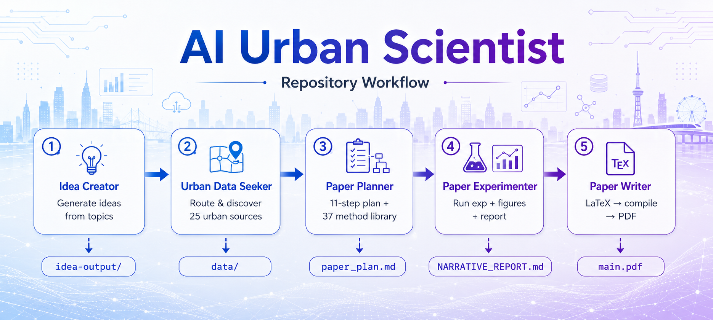

# AI-Urban-Sci — Autonomous Urban Science Research Pipeline

[](./skills/)
[](https://claude.ai/code)
[](./LICENSE)

A suite of five **Claude Code skills** that together form an end-to-end autonomous research pipeline for urban science — from idea generation to submission-ready paper. Each skill can be used independently or as part of the full serial pipeline.




---

## Pipeline Overview

| # | Skill | Role | Input | Output |
|---|-------|------|-------|--------|
| ① | **idea-creator-user-llm** | Generate & validate research ideas | Research topic / keywords | `idea-output/*.md` (with novelty check) |
| ② | **urban-data-seeker** | Discover urban datasets | Data request / URL / topic | Route result → data download |
| ③ | **paper-planner** | Create execution plan | Idea + available data | `paper_plan.md` |
| ④ | **paper-experimenter** | Run experiments & generate results | `PAPER_PLAN.md` + `data/` | `NARRATIVE_REPORT.md` + figures + tables |
| ⑤ | **paper-writer** | Write & compile paper | `NARRATIVE_REPORT.md` + figures | `main.pdf` (Nature template) |


---

## ① Idea Creator — User LLM

Generate structured, publishable research ideas with four distinct modes. Built for urban science domains: climate, mobility, demographics, remote sensing, public health, and policy.

### Four Modes

| Mode | How it works | API Key Required | Best for |
|------|-------------|-----------------|----------|
| **CAMP** | Server-side paper retrieval → CAMP hypothesis generation → idea | Yes | Literature-grounded, novel ideas |
| **DIRECT** | Claude-native reasoning + optional web search | No | Fast exploration, offline use |
| **FAST** | Direct LLM call with urban science expert prompt | Yes | Quick single-idea generation |
| **novelty** | Searches Semantic Scholar / arXiv, analyzes related papers, appends `## Novelty Check` to an existing idea file | Yes | Validate idea novelty against literature |

### Usage

```text
# Generate an idea
/idea-creator-user-llm DIRECT --temperature 0.7 Urban heat island and public health
/idea-creator-user-llm CAMP --paper_domain Economics Urbanization and income inequality
/idea-creator-user-llm FAST Climate adaptation and urban resilience

# Check novelty of an existing idea
/idea-creator-user-llm novelty ./idea-output/2026-06-29_urban_heat_camp.md
/idea-creator-user-llm novelty --source arxiv ./idea-output/2026-06-29_urban_heat_camp.md
```

### Quick Start

```bash
bash skills/idea-creator-user-llm/install_user_llm_skill.sh
```

For CAMP/FAST/novelty modes, create `~/.claude/skills/idea-creator-user-llm/credentials.json`:

```json
{
  "openai_api_key": "sk-...",
  "openai_base_url": "https://api.openai.com/v1",
  "llm_model": "gpt-4o-mini",
  "semantic_scholar_api_key": ""
}
```

Any OpenAI-compatible provider works. `semantic_scholar_api_key` is optional but recommended to avoid rate limits.

### Files

```text
idea-creator-user-llm/
├── SKILL.md                     # Full skill definition (4 modes)
├── README.md                    # Summarized documentation
└── install_user_llm_skill.sh    # One-command installer
```

---

## ② Urban Data Seeker

The single routing layer for urban dataset discovery and acquisition. Routes requests to **25 downstream skills** (9 platforms + 16 concrete sources) covering authoritative urban, demographic, geospatial, environmental, transit, and remote sensing data.

### Domain Coverage — 16 Areas Across 6 Categories

#### I. Society & Economy

| Area | Source | Coverage | Granularity | Use Case |
|------|--------|----------|-------------|----------|
| Demographics | **Census ACS** | United States | Tract / Block Group / County / Place | Population, income, education, housing, commute estimates with margins of error |
| Economy & Labor | **World Bank Indicators** | 200+ countries | Country / Year | GDP, poverty, urbanization, health, education development indicator time series |
| Economy & Labor | **OECD Data** | 38 OECD + partner countries | Country / Region / Metropolitan area | Economy, labor, education, environment, urban statistics via SDMX queries |
| Public Health | **WHO GHO** | 194 member states | Country / Year / Dimension | Mortality, disease burden, health systems, SDG health indicators via OData API |

#### II. Environment & Natural Resources

| Area | Source | Coverage | Granularity | Use Case |
|------|--------|----------|-------------|----------|
| Climate & Weather | **NOAA Weather** | US + global stations | Station / Daily / Hourly | Temperature, precipitation, wind observations; station inventory and LCD hourly resolution via NCEI/CDO API |
| Air Quality | **OpenAQ** | Global (cross-provider aggregation) | Station / Hourly measurements | PM2.5, PM10, NO₂, O₃, SO₂, CO pollutant observations via API query and sampling |

#### III. Remote Sensing & Geospatial

| Area | Source | Coverage | Granularity | Use Case |
|------|--------|----------|-------------|----------|
| Earth Observation | **NASA Earthdata CMR** | Global | Collection / Granule | MODIS, Landsat, SRTM satellite product catalog search by keyword, short_name, bbox, and temporal filter (Earthdata Login required) |
| Earth Observation | **Planetary Computer** | Global | STAC Item / Pixel-level raster | Microsoft cloud-hosted Sentinel-2, Landsat, NAIP; STAC API search with signed asset URLs |
| Earth Observation | **STAC Platform** ⚙️ | Global (any STAC endpoint) | Collection / Item / Asset | SpatioTemporal Asset Catalog standard: collection discovery → item search → asset href resolution with bbox+datetime+cloud-cover filtering |
| Urban Morphology | **Microsoft Building Footprints** | Global (per-country shards) | Individual building polygon | ML-extracted building footprint GeoJSON/GeoParquet for built-up area, building density, and urban morphology analysis |
| Urban Morphology | **OSM Geofabrik Extracts** | Global (continent/country/region) | PBF / Shapefile regional extract | Roads, buildings, POIs, land use from OpenStreetMap — large-area bulk download |

#### IV. Transportation & Mobility

| Area | Source | Coverage | Granularity | Use Case |
|------|--------|----------|-------------|----------|
| Public Transit | **GTFS Feed** | Global transit agencies | Route / Stop / Trip / stop_times | Static transit schedules (routes, stops, trips, calendar, shapes) for accessibility analysis and transit network modeling |
| Micromobility | **GBFS Bikeshare** | Global bikeshare systems | Station / Near-realtime | Shared bike and scooter station status, vehicle availability, dock counts via near-realtime API |
| Trip Records | **NYC TLC** | New York City, US | Individual trip record | Yellow/green taxi and FHV ride-hail trip records (pickup/dropoff, fare, time), monthly Parquet files |

#### V. Urban Form & Spatial

| Area | Source | Coverage | Granularity | Use Case |
|------|--------|----------|-------------|----------|
| Administrative Boundaries | **US TIGER Boundaries** | United States | Tract / Block Group / County / Place / ZCTA | Census official boundary shapefiles/geodatabases; GEOID directly joins ACS attribute tables |

#### VI. Institutions & Governance

| Area | Source | Coverage | Granularity | Use Case |
|------|--------|----------|-------------|----------|
| Federal Open Data | **Data.gov Catalog** | US Federal Government | Dataset package / Resource file | CKAN-backed federal agency open data catalog: package_search discovery and resource URL resolution |
| Humanitarian Data | **HDX Catalog** | Global (humanitarian focus) | Country / Dataset | Disaster, conflict, administrative boundaries, food security, health, refugee data downloads |
| Planning Documents | **Document Portal Platform** ⚙️ | Municipal governments worldwide | Individual PDF/HTML document | Urban master plans, comprehensive plans, zoning text, environmental reports — official document location and version verification |
| Municipal Legislation | **Legistar Platform** ⚙️ | US municipal legislatures | Individual ordinance/resolution/meeting | Municipal legislation, ordinance voting, meeting agendas, minute records, and attachment retrieval with legislative history |

#### 9 Platform Adapters (Cross-Cutting)

These nine Platform Skills encapsulate reusable API protocols — the Source layer determines *where to look*; the Platform layer handles *how to search, probe, and download*:

| Platform | Protocol | Representative Instances | Core Capability |
|----------|----------|--------------------------|-----------------|
| **Socrata** | SODA / SoQL | Chicago, NYC, SF, LA, Seattle, Austin, CDC, DOT | Cross-instance catalog search → view metadata probe → SoQL filtering → CSV/JSON export |
| **ArcGIS** | ArcGIS REST | FEMA NFHL, HIFLD, municipal ArcGIS Hubs | FeatureServer/MapServer search → layer metadata → `/query` URL (where/bbox/outFields) |
| **CKAN** | CKAN Action API | Data.gov, HDX, data.gov.hk, data.london.gov.uk | `package_search` → `package_show` → `resources[].url` resolution → HEAD probe |
| **Dataverse** | Dataverse API | Harvard Dataverse, DataverseNL | dataset.xhtml → persistentId → file metadata → `/api/access/datafile/` download |
| **STAC** | STAC 1.0 | Planetary Computer, Earth Search (AWS) | `/collections` → `/items` → asset href → optional signing/requester-pays handling |
| **SDMX** | SDMX REST | OECD, Eurostat | dataflow → dimension/codelist → series key → time series data |
| **OData** | OData v4 | WHO GHO | `$metadata` → entity set → `$filter/$select/$top/$skip` → JSON pagination |
| **Document Portal** | HTML/PDF scraping | Municipal planning department websites | Official document landing page discovery → file type/version verification → download |
| **Legistar** | Legistar/Granicus | Chicago, NYC, Los Angeles city councils | Matter/File ID resolution → legislation detail → agenda/voting/attachment PDF |

### Usage

```text
/urban-data-seeker Find NYC taxi trip data for 2023
/urban-data-seeker Get PM2.5 measurements for Chicago census tracts
/urban-data-seeker Download building footprints for Los Angeles county
```

### Core Workflow

1. Parse the request → source, topic, geography, time, format
2. Run `route_data_request.py` → deterministic routing to top-3 skills
3. Open only the selected downstream skill files
4. Probe before fetching → validate source, schema, license, coverage
5. Return structured output with confidence, access boundary, next probe

### Files

```text
urban-data-seeker/
├── SKILL.md                            # Top-level routing skill
├── agents/openai.yaml                  # Agent interface metadata
├── scripts/
│   ├── route_data_request.py           # Deterministic skill router
│   ├── inspect_skill.py                # Skill introspection
│   └── validate_data_seeker_bundle.py  # Bundle integrity check
└── references/
    ├── route_index.compact.jsonl        # Compact routing index
    ├── selected_skills.json             # Skill inventory (25 entries)
    ├── routing_rules.md                 # Scoring rules & priority
    ├── native_skills/                   # 25 downstream skills
    │   ├── socrata-platform/
    │   ├── census-acs/
    │   ├── ... (25 directories)
    └── platforms/                       # 9 platform support packages
        ├── socrata_platform/
        ├── ckan_platform/
        └── ...
```

---

## ③ Paper Planner

Turn a research idea into a **single-file, human-reviewable research execution plan**. Nine pipeline stages with in-stage checkpoints (shift-left, fail-fast), branch profiles by contribution type, and a terminal quality gate with typed back-edges.

### Pipeline Architecture

Paper Planner is structured as a **staged planning pipeline** — eight sequential stages transform a polymorphic input (article, idea, dataset, or result draft) into an executable plan. After FRAME, the pipeline **branches by contribution type** to route each design down the right method/evaluation/robustness sub-chain.

```
① INGEST → ② FRAME → branch by type → ③ GROUND → ④ CALIBRATE
→ ⑤ ARCHITECT → ⑥ RENDER → ⑦ STRESS → ⑧ INTERPRET → ⑨ GATE
```

At each stage, a **checkpoint** catches defects early (fail → typed back-edge to owning stage). The terminal **GATE** re-confirms all nine checks; the plan is never emitted with an unresolved fail — the claim is downgraded honestly instead.

### Branch Profiles (6 contribution types)

After FRAME, the contribution type selects a branch that parameterizes CALIBRATE, ARCHITECT, and STRESS:

| Branch | For | Mandatory task | Claim ceiling |
|--------|-----|---------------|---------------|
| **Causal** | causal / quasi-causal | identifying-assumption test | causal only if assumptions hold |
| **Predictive** | prediction / classification | held-out evaluation + calibration | predictive; no causal language |
| **Descriptive** | description / measurement | validation-against-reference + coverage | descriptive; no effect framing |
| **Mechanistic** | mechanism | mediator-validity + temporal ordering | mechanism only with evidence |
| **Simulation** | simulation / scenario | calibration-to-baseline + uncertainty | conditional on assumptions |
| **Mixed** | mixed methods | each part's task | weakest composed ceiling |

### Three Architectural Properties

- **Polymorphic ingestion** — one entry point normalizes article/idea/dataset/result draft into typed seed facts
- **Knowledge-base sidecar** — 37-category Method Library plugs in via lazy INDEX retrieval; core pipeline stays generic
- **Closed-loop quality control** — nine checks enforced at in-stage checkpoints + terminal GATE; failures route to owning stage

### Method Library (37 categories)

```text
references/method_library/
├── INDEX.md                         # Start here
├── causal_inference.md
├── climate_health_attribution.md
├── environmental_epidemiology.md
├── human_mobility.md
├── ml_prediction.md
├── natural_experiment.md
├── remote_sensing_socioeconomics.md
├── spatial_analysis.md
├── urban_network_gnn.md
├── ... (37 categories total)
```

### Usage

```text
/paper-planner Create a plan from this idea / article / dataset.
```

### Output

- `plans/paper-plan/paper_plan.md` — human-review document (all sections)
- `plans/paper-plan/agent_plan.json` — machine-readable plan (on request only)

### Files

```text
paper-planner/
├── SKILL.md                         # Full skill definition (9-stage pipeline)
├── README.md                        # Architecture & branch profiles
├── agents/openai.yaml               # Agent interface metadata
└── references/
    ├── output_templates.md          # Compact templates
    └── method_library/              # 37 category files + INDEX
```

---

## ④ Paper Experimenter

Executes the **experiment phase**: reads a research plan, audits available data, runs experiments, generates figures and tables, and produces a narrative report mapping every subclaim to its `support_status`. Hands off cleanly to `paper-writer`.

### Pipeline

```text
PAPER_PLAN.md
    │
    ▼
┌──────────────────────────────────────────────┐
│  Step 1–3   Locate plan, create output dir,  │
│             audit existing data/results      │
├──────────────────────────────────────────────┤
│  Step 4     Execute experiments              │
│             (real data first)                │
├──────────────────────────────────────────────┤
│  Step 5     Generate figures (PDF/SVG/PNG)   │
│             & LaTeX tables                   │
├──────────────────────────────────────────────┤
│  Step 6     Write narrative report           │
│             (claim-by-claim evidence mapping)│
└──────────────────────────────────────────────┘
    │
    ▼
NARRATIVE_REPORT.md + figures/ + tables/ → ready for paper-writer
```

### Usage

```text
/paper-experimenter                  # auto-detect latest plan
/paper-experimenter <subfolder>     # use plan-output/<subfolder>/
```

### Output Structure

```text
paper-output/<idea-stem>/
├── exp/           # Experiment scripts (.py)
├── results/       # Experiment outputs (CSV, JSON)
│   ├── <task_id>_results.csv
│   ├── NARRATIVE_REPORT.md          # ← consumed by paper-writer
│   └── narrative_report.json
├── figures/       # PDF, SVG, PNG per figure + source data CSV
├── tables/        # LaTeX tables (.tex)
└── paper/         # Placeholder for paper-writer
```

### Core Rules

- **Real data first**: scripts load from `data/` when files exist
- **Consume before creating**: never re-run completed work
- **No user interaction**: fully autonomous
- **No fabrication**: all numbers trace to `results/` files
- **Clean handoff**: narrative report is the contract with `paper-writer`

### Files

```text
paper-experimenter/
├── SKILL.md                     # Full skill definition (7-step workflow)
├── README.md                    # Summarized documentation
└── references/
    └── figure-style.md          # Figure style constants, output formats, script patterns
```

---

## ⑤ Paper Writer

Writes and compiles a **submission-ready paper** from experiment results. Reads the narrative report, writes LaTeX with Nature template, runs quality gate verification, and compiles to PDF.

### Pipeline

```text
NARRATIVE_REPORT.md + PAPER_PLAN.md
    │
    ▼
┌──────────────────────────────────────────────┐
│  Step 1     Verify prerequisites             │
│             (hard stop if results missing)   │
├──────────────────────────────────────────────┤
│  Step 2     Write LaTeX paper                │
│             (Nature \documentclass)          │
├──────────────────────────────────────────────┤
│  Step 3     Quality gate check               │
│             (subclaim-evidence tracing)      │
├──────────────────────────────────────────────┤
│  Step 4     Compile to PDF                   │
│             (latexmk + pdflatex, max 3 retry)│
└──────────────────────────────────────────────┘
    │
    ▼
main.pdf  (Nature-format, submission-ready)
```

### Usage

```text
/paper-writer                          # auto-detect latest paper-output/
/paper-writer <paper-output-subfolder> # use specific output dir
```

### Prerequisites

Must be run **after** `paper-experimenter`. Requires:
- `paper-output/<idea-stem>/results/NARRATIVE_REPORT.md`
- `paper-output/<idea-stem>/results/narrative_report.json`
- `paper-output/<idea-stem>/figures/` (≥1 figure)
- `plan-output/<name>/PAPER_PLAN.md`

If any are missing, stops with an error — **does not write a paper without results**.

### Core Rules

- **Results-first**: never write a paper without experiment results
- **Claim-calibrated language**: matched to `support_status` from narrative report
- **No fabrication**: no invented URLs, BibTeX, or citations
- **No user interaction**: fully autonomous
- **Self-contained**: all compile logic in `references/compile.md`

### Files

```text
paper-writer/
├── SKILL.md                     # Full skill definition (5-step workflow)
├── README.md                    # Summarized documentation
└── references/
    ├── latex-template.md        # Nature \documentclass preamble + document structure
    ├── writing-rules.md         # Language calibration, structural rules, forbidden words
    └── compile.md               # LaTeX → PDF compilation with error diagnosis & fix loop
```

---

## Complete Pipeline Example

```text
# Step 1 — Generate an idea
/idea-creator-user-llm CAMP --retrieval_limit 8 \
  Urban heat island effects on emergency room visits in Chicago

# Step 2 — Check novelty of the generated idea
/idea-creator-user-llm novelty ./idea-output/2026-06-29_urban_heat_camp.md

# Step 3 — Find required data
/urban-data-seeker Get Chicago hourly weather, ER visits by ZIP code, and census demographics

# Step 4 — Create a research plan (informed by available data + novelty check)
/paper-planner Create a plan from the generated idea and available datasets

# Step 5 — Run experiments, generate figures, produce narrative report
/paper-experimenter

# Step 6 — Write and compile the paper
/paper-writer
```

---

## Installation

Clone this repository and install each skill into your Claude Code configuration:

```bash
git clone <repo-url>
cd AI-Urban-Sci

# Copy skills to Claude Code skills directory
cp -r skills/* ~/.claude/skills/

# For idea-creator-user-llm (CAMP/FAST/novelty), configure credentials:
mkdir -p ~/.claude/skills/idea-creator-user-llm
cat > ~/.claude/skills/idea-creator-user-llm/credentials.json << 'EOF'
{
  "openai_api_key": "sk-...",
  "openai_base_url": "https://api.openai.com/v1",
  "llm_model": "gpt-4o-mini",
  "semantic_scholar_api_key": ""
}
EOF
```

---

## Repository Structure

```text
AI-Urban-Sci/
├── README.md                           # This file
└── skills/
    ├── idea-creator-user-llm/          # Skill ① — Idea generation & validation
    │   ├── SKILL.md
    │   ├── README.md
    │   └── install_user_llm_skill.sh
    ├── urban-data-seeker/              # Skill ② — Urban data discovery
    │   ├── SKILL.md
    │   ├── agents/
    │   ├── scripts/
    │   └── references/
    ├── paper-planner/                  # Skill ③ — Research planning (9-stage pipeline)
    │   ├── SKILL.md
    │   ├── README.md
    │   ├── agents/
    │   └── references/
    ├── paper-experimenter/             # Skill ④ — Experiment & results
    │   ├── SKILL.md
    │   ├── README.md
    │   └── references/
    └── paper-writer/                   # Skill ⑤ — Paper writing & compilation
        ├── SKILL.md
        ├── README.md
        └── references/
```

---

## Design Principles

- **One file per output**: plans are human-reviewable single files; papers compile from one monolithic `.tex`
- **Honest claims**: claim strength matches the identification strategy — downgrade rather than overstate
- **Real data first**: never fabricate data when real sources exist; synthetic data is explicitly disclosed
- **Results before writing**: paper-writer requires a narrative report — never write without evidence
- **No invention**: unknown facts stay marked unknown; extensions to existing work are labeled
- **No user interaction**: fully autonomous — if blocked, apply fallback and continue
- **Consume before creating**: never re-run completed work

---

## Requirements

- [Claude Code](https://claude.ai/code) (all skills)
- Python 3 (urban-data-seeker, paper-experimenter)
- LaTeX distribution with `pdflatex` and `latexmk` (paper-writer)
- OpenAI-compatible API key (idea-creator CAMP/FAST/novelty modes only)
- Semantic Scholar API key (idea-creator novelty mode, optional but recommended)

---

## Credits

**Affiliation**: Zhongguancun Academy

| Skill | Lead |
|-------|------|
| ① idea-creator-user-llm | Jiankun Zhang |
| ② urban-data-seeker | Runwen You |
| ③ paper-planner | Jingzhi Wang |
| ④ paper-experimenter<br>⑤ paper-writer | Ao Xu |

**Advisors**: Tong Xia, Yong Li
