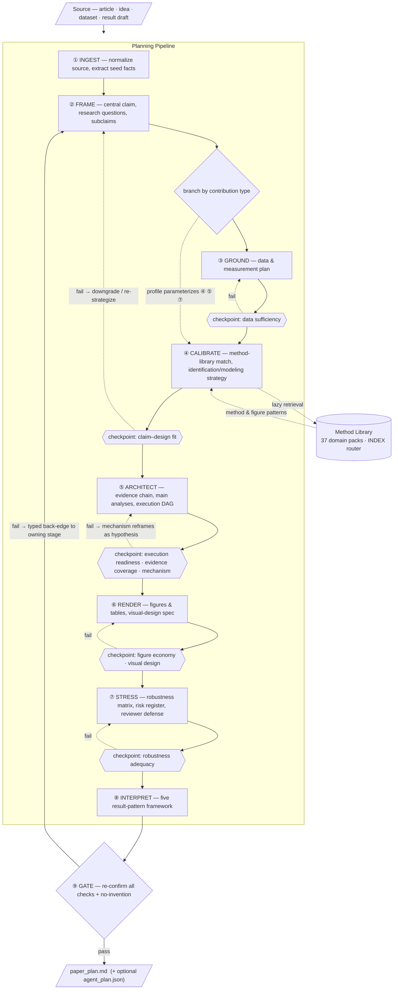

# Paper Planner

A Claude Code skill that turns a research idea, dataset sketch, result draft, or existing article into a **single-file, human-reviewable research paper execution plan**.

The plan is detailed enough to guide a researcher or coding agent through the work, yet compact enough to review in one sitting.

## What It Produces

By default, one file:

```text
plans/paper-plan/paper_plan.md
```

This is the human review document and holds every plan section. A machine-readable `agent_plan.json` is produced **only** when you explicitly ask for it.

A finished plan answers five questions:

1. **What is the paper claiming?** — central claim, strength, subclaims, falsification conditions.
2. **How would it be executed?** — data, variables, identification/modeling strategy, an analysis task DAG with acceptance criteria.
3. **What would persuade a skeptical reviewer?** — evidence chain, figures, tables, validation, robustness.
4. **What could go wrong?** — data gaps, measurement and identification threats, scope limits.
5. **How should different result patterns be interpreted?** — primary, null, heterogeneous, mechanism-only, and fragile outcomes.

## How To Use

Invoke the skill and hand it your input:

```text
/paper-planner Create a plan from this article / idea / dataset.
```

It works from any of these inputs:

- an existing article (or article JSON) — preserves the source's real title, data, methods, and contribution;
- a research idea or dataset sketch — marks unknowns and proposes the smallest credible choices;
- a result sketch or early analysis — separates observed from planned/hypothetical results.

## Architecture

Paper Planner is structured as a **staged planning pipeline** — the same shape a real paper takes, from raw idea to defensible argument. Eight sequential stages transform a polymorphic input into an executable plan; right after framing, the pipeline **branches by contribution type** to route each design down the right method/evaluation/robustness sub-chain. In-stage **checkpoints** catch defects early (shift-left, fail-fast), a terminal gate re-confirms every check, and **typed back-edges** route each failure to the exact stage that owns it. A domain knowledge base feeds the calibration stage on demand.



### Pipeline stages

| Stage | Underlying steps | Transforms | Produces |
| --- | --- | --- | --- |
| **① INGEST** | Step 1 | raw source → typed facts | seed facts, contribution type, known unknowns |
| **② FRAME** | Step 2 | facts → testable argument | central claim, research questions, subclaims |
| **③ GROUND** | Step 3 | argument → measurable quantities | dataset specs, variable construction table |
| **④ CALIBRATE** | Steps 4–5 | quantities → method | method-library match, identification/modeling strategy |
| **⑤ ARCHITECT** | Steps 6–7 | method → executable work | evidence chain, main analyses, task DAG |
| **⑥ RENDER** | Step 8 | results → publication artifacts | figures, tables, visual-design spec |
| **⑦ STRESS** | Step 9 | claim → reviewer-proofed claim | robustness matrix, risk register, defense |
| **⑧ INTERPRET** | Step 10 | one result → five contingencies | interpretation framework |
| **⑨ GATE** | Step 11 | draft plan → certified plan | checkpoint re-confirmation, typed back-edges, gate verdicts |

### Three architectural properties

- **Polymorphic ingestion** — one entry point accepts an article, an idea, a dataset sketch, or a result draft; the INGEST stage normalizes each into the same typed seed facts so all downstream stages are input-agnostic.
- **Knowledge-base sidecar** — domain expertise lives in a pluggable Method Library, not in the engine. CALIBRATE retrieves only the matching domain packs (lazy load via the INDEX router), keeping the core pipeline generic and the corpus independently extensible.
- **Closed-loop quality control** — nine checks (claim–design fit, data sufficiency, execution readiness, evidence coverage, mechanism discipline, robustness adequacy, figure economy, visual design, no-invention) are enforced at in-stage checkpoints (shift-left, fail-fast) and re-confirmed at the terminal GATE. A failed gate follows a **typed back-edge** to the stage that owns the defect — not a blanket restart — and the plan is never emitted with an unresolved fail; the claim is downgraded honestly instead.

For the full step-by-step specification of each stage, see [`SKILL.md`](SKILL.md).

### Branch profiles

After FRAME, the contribution type selects a branch profile that parameterizes CALIBRATE (which strategy family), ARCHITECT (which mandatory evaluation task), STRESS (which mandatory checks), and the highest claim strength allowed. The terminal GATE fails any plan whose claim exceeds its branch ceiling.

| Branch | For | Mandatory task (ARCHITECT) | Key checks (STRESS) | Claim ceiling |
| --- | --- | --- | --- | --- |
| **Causal** | causal / quasi-causal | identifying-assumption test | balance, pre-trends, placebo, confounding sensitivity | causal only if assumptions hold |
| **Predictive** | prediction / classification | held-out evaluation + calibration | CV, calibration, external validation, ablation, leakage audit | predictive performance, no causal language |
| **Descriptive** | description / measurement | validation-against-reference + coverage | sampling/coverage, reliability, measurement-error sensitivity | descriptive; no effect framing |
| **Mechanistic** | mechanism | mediator-validity + temporal ordering | alternative-pathway tests, mediator error, ordering | mechanism only with mechanism evidence |
| **Simulation** | simulation / scenario | calibration-to-baseline + uncertainty propagation | parameter uncertainty, scenario sensitivity, validation vs observations | conditional on stated assumptions |
| **Mixed** | mixed | each part's task | each part's checks | weakest composed ceiling; name the boundary |

## Method Library

```text
references/method_library/
```

A library of reusable planning references (37 category files), each linking a method specification to a paper-planning pattern: evidence chain, figure architecture, narrative arc, claim shape, and claim strength. Start with `INDEX.md`, match by domain/method/outcome/keyword, then open only the relevant category files. Borrow method and figure patterns — never another paper's results or effect sizes.

## Figure Aesthetics Standard

Figures are planned as arguments and held to a publication-grade visual standard (Nature/Science/PNAS), not library defaults:

- **Palette by data meaning** — sequential (`viridis`/ColorBrewer), diverging (`RdBu`/`coolwarm`, midpoint pinned to zero), or categorical (Okabe–Ito/`Set2`, ≤7 classes). No rainbow/jet maps.
- **Colorblind-safe and reproducible** — color paired with a redundant channel (shape/line style/labels), exact hex codes, grayscale-readable.
- **Consistent, economical composition** — one palette/font/sizing scheme across the set, maximized data-ink, explicit uncertainty, vector/≥300 dpi at print column width.

Each main figure records these in the **Figure Design Spec** of the template.

## Files

```text
paper-planner/
├── SKILL.md                          # full skill instructions and planning standard
├── README.md                         # this file
├── agents/openai.yaml                # agent interface metadata
└── references/
    ├── output_templates.md           # compact templates for paper_plan.md and agent_plan.json
    └── method_library/               # 37 domain category files + INDEX.md
```

## Design Principles

- One human-review file unless the user asks otherwise.
- No invention: unknown facts stay marked unknown; extensions to an existing article are labeled as extensions.
- Claim strength must match the identification/modeling strategy — downgrade an honest claim rather than overstate causality.
- Robustness is tied to the design's actual threats, not generic sensitivity.
