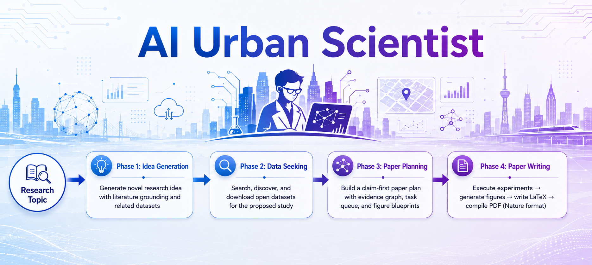

# AI Urban Scientist
<p align="center">
  
</p>

> **面向城市科学的自主AI科学家- 从研究主题到论文发表的全流程自动化。**

Urban AIScientist 是一个面向城市科学领域的全自动研究管线系统。给定一个研究主题，系统独立完成完整的科研生命周期:基于文献调研的idea生成、开放数据的发现与获取、实验设计与执行、统计分析、可视化图表生成，以及Nature格式论文撰写与 PDF 编译。该系统实现了AIScientist 范式，在城市科学领域实现从假设形成、经验验证到学术写作的自主化闭环。

🌐 **在线体验**：[https://cocoa-heap-turbulent.ngrok-free.dev](https://cocoa-heap-turbulent.ngrok-free.dev)

> 💬 [English Version →](./README.md)

---

## 作者

作者按英文名首字母顺序排列：

| Author | Affiliation |
|--------|-------------|
| **Ao Xu** (徐奥) | 北京中关村学院，吉林大学 |
| **Jiankun Zhang** (张鉴坤) | 北京中关村学院，吉林大学 |
| **Jingzhi Wang** (王经知) | 北京中关村学院，华东师范大学 |
| **Runwen You** (游润文) | 北京中关村学院，吉林大学 |
| **Tong Xia** (夏彤) | 清华大学，北京中关村学院 |
| **Yong Li** (李勇) | 清华大学，北京中关村学院 |

---

## 管线概览

```
研究主题
  │
  ▼
┌─────────────────────────────────────────────────┐
│  Phase 1: Idea Generation                        │
│  生成研究 idea，含 novelty 分析与相关文献          │
│  → idea-output/*.md                              │
└─────────────────────────────────────────────────┘
  │  （用户 review：继续 / 重新生成 / 取消）
  ▼
┌─────────────────────────────────────────────────┐
│  Phase 2: Data Seeking                           │
│  搜索并下载 open datasets，生成可用性报告          │
│  → data/DATA_SEEKER_REPORT.md                    │
└─────────────────────────────────────────────────┘
  ▼
┌─────────────────────────────────────────────────┐
│  Phase 3: Paper Planning                         │
│  生成 claim-first 论文计划 + 实验执行方案          │
│  → plan-output/PAPER_PLAN.md                     │
└─────────────────────────────────────────────────┘
  ▼
┌─────────────────────────────────────────────────┐
│  Phase 4: Paper Writing                          │
│  执行实验 → 生成图表 → 撰写 LaTeX → 编译 PDF      │
│  → paper-output/*/paper/main.pdf                 │
└─────────────────────────────────────────────────┘
```

4 个阶段**顺序执行**，实时 SSE 流式推送进度。

---

## 使用方法

### 1. 打开网站

访问上面的在线体验链接。

### 2. 认证

| 方式 | 说明 |
|------|------|
| **通行证** | 输入共享 passphrase，验证通过后自动隐藏 API Key 输入框 |
| **自带 API Key** | 填入你自己的 API Key + Base URL（任意 OpenAI 兼容接口） |

### 3. 选择生成模式

| 模式 | 说明 |
|------|------|
| **CAMP** | 基于论文检索生成 idea，先检索相关文献，idea 有文献支撑 |
| **SEMM** | 直接从主题生成 idea，无需预检索，速度更快 |
| **FAST** | 纯 LLM 轻量生成，不依赖后端 API，最快 |

### 4. 选择模型（可选）

通过通行证访问时可切换：

`claude-sonnet-4-6` · `glm-5.1` · `qwen3.5-plus` · `qwen3.7-max` · `mimo-v2.5-pro` · `deepseek-v4-pro` 

默认使用 `claude-sonnet-4-6`。

### 5. 输入研究主题

支持中英文。例如：

- `Urban flood prediction using satellite imagery`
- `基于 BRFSS 数据集量化高温与睡眠不足的关系`
- `网约车对城市通勤效率的影响分析`

### 6. 启动管线

点击 **Launch**：

- 实时进度日志（SSE 流式推送）
- 每个阶段完成后高亮显示
- 可下载已完成阶段的产出物

### 7. Idea Review

Phase 1 完成后，展示 idea 预览（标题 + 摘要），可选：

| 操作 | 说明 |
|------|------|
| **继续** | 认可当前 idea，进入下一阶段 |
| **重新生成** | 清空当前 idea，重新生成 |
| **取消** | 终止整个管线 |

30 秒无操作自动继续。

### 8. 下载产出物

| 阶段 | 产出物 |
|------|--------|
| Idea | 研究 idea 文档（Markdown） |
| Data | 数据集下载报告 |
| Plan | 论文计划（含实验设计） |
| Paper | 最终论文 PDF（Nature 格式） |

---

## 论文示例

[`examples/`](../examples/) 目录存放系统生成的完整论文示例，包含最终 PDF
以及（如有）完整的中间产出文件（idea、数据报告、论文计划、图表）。
上传新论文时，请同时更新本目录下的示例列表。

---

## 技术架构

```
┌──────────────┐      SSE       ┌──────────────────┐
│   Frontend   │ ◄────────────► │   FastAPI 后端    │
│  (Vue 3 SPA) │               │                   │
└──────────────┘               └────────┬─────────┘
                                        │
                              4× 串行 AI Agent 调用
                              （流式 JSON 模式）
                                        │
                              ┌────────┬┴────────┐
                              ▼        ▼        ▼
                          Idea     Data     Paper
                        Generator Seeker  Writer
```

- **前端**：Vue 3 + Vite，SPA 单页应用
- **后端**：FastAPI + SSE 流式推送
- **管线引擎**：4 次串行 AI Agent 调用，每次执行一个专项 skill
- **论文编译**：LaTeX（`nature.cls` 模板）+ `latexmk`
- **公网访问**：ngrok（固定域名）/ Cloudflare Tunnel

---

## 注意事项

- **同时仅一个管线运行** — 并发锁保证只有一个任务在执行
- **不要关闭浏览器标签页** — SSE 连接断开后任务会被取消
- **预计耗时**：30–60 分钟（Idea ~5 min → Data ~10 min → Plan ~10 min → Paper ~20–40 min）
- **API 消耗**：自带 Key 时完整管线约 **$5–15**（取决于模型和 topic 复杂度）
- **结果存储**：按 job ID 隔离存储在服务器，建议及时下载

---

## FAQ

**Q: 提示 "another job is running" 怎么办？**  
A: 等待当前任务完成后重试。

**Q: 任务中途失败了能恢复吗？**  
A: 可以。系统重试时会自动跳过已完成的阶段，从断点处继续。

**Q: 可以用中文主题吗？**  
A: 可以，中英文均支持。

**Q: 必须用 Anthropic 的 Key 吗？**  
A: 不需要。任何 OpenAI 兼容的 API 中转站都可以，提供 Key + Base URL 即可。

**Q: 生成的论文是什么格式？**  
A: Nature 期刊格式的 LaTeX 单文件 + 编译后的 PDF。

---

## 许可证

MIT

---

## 联系我们

需要通行证或有问题？在本仓库提 [Issue](../../issues)。
